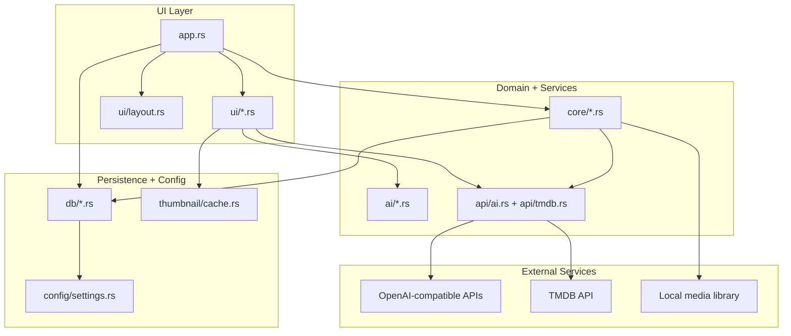

# AI-Movie-Player

An AI-native local movie library companion for people who care about cinema, not just files.

English | [简体中文](readme-cn.md)

[](https://www.rust-lang.org)
[](LICENSE)
[](https://github.com/peixl/AI-Movie-Player/releases)
[](https://github.com/peixl/AI-Movie-Player/actions/workflows/ci.yml)
[](https://github.com/peixl/AI-Movie-Player#ai-features)

Built by [ifq.ai](https://ifq.ai) and open sourced at [peixl/AI-Movie-Player](https://github.com/peixl/AI-Movie-Player).

## Overview

AI-Movie-Player is an early-stage desktop companion for local movie libraries, built with Rust and egui. It combines library management, TMDB metadata, subtitles, poster-wall browsing, system-player launch, and OpenAI-compatible AI features in one quiet, cinema-first experience.

This project is designed to feel more like a thoughtful film tool than a generic media utility. The AI is there to help you choose, understand, and revisit films naturally, not to dominate the product.

## Current Status

AI-Movie-Player is currently a beta-quality local library app, not a fully embedded media playback engine. From a movie detail page it can launch the local file with the operating system's default player; native playback controls inside the app are on the roadmap.

## Tech Stack

| Layer | Technology |
| --- | --- |
| Language | Rust (edition 2024, MSRV 1.85) |
| GUI Framework | [egui](https://github.com/emilk/egui) / eframe 0.31 |
| Async Runtime | [Tokio](https://tokio.rs) |
| Database | [SQLite](https://sqlite.org) via rusqlite (WAL mode, FTS5) |
| HTTP Client | [reqwest](https://github.com/seanmonstar/reqwest) (gzip, brotli, stream) |
| Image | [image](https://github.com/image-rs/image) crate |
| Error Handling | [thiserror](https://github.com/dtolnay/thiserror) + [anyhow](https://github.com/dtolnay/anyhow) |
| CI/CD | GitHub Actions (multi-OS matrix) |

## Architecture



The application entry point owns navigation and shared state in app.rs. UI panels stay focused on rendering and interaction, while domain services under src/core and src/ai handle library, metadata, subtitles, and AI workflows. Database access stays under src/db, and release automation is driven by the scripts directory plus GitHub Actions workflows.

## Why AI-Movie-Player

- AI companion chat with real multi-turn memory for a selected film.
- Taste-aware recommendations generated from your own library.
- Open local movie files from the detail page through your system player.
- AI quick insight and review flows directly from movie details.
- TMDB-powered metadata enrichment for titles, cast, directors, ratings, and posters.
- Subtitle discovery and download workflow for local collections.
- Poster-wall browsing, batch import, watchlist, and settings in a native desktop app.
- Subtle ifq.ai authorship instead of heavy-handed branding.

## AI Features

### AI Companion

Select a movie and talk to the AI with actual movie context: title, year, director, genres, synopsis, and cast. The chat now keeps conversation history, so follow-up questions feel coherent instead of stateless.

Good prompts include:

- deep analysis
- ending interpretation
- similar films
- production trivia
- watch companion brief
- honest should-I-watch-it verdicts

### AI Taste Engine

The recommendation flow looks at your own library and suggests what to watch next, why it fits your taste, where your blind spots are, and which outside films you are likely to love.

### AI Review

From the movie detail view, you can jump into AI insight for a compact review, audience fit, strengths, weaknesses, and viewing guidance.

### OpenAI-Compatible Providers

AI-Movie-Player works with:

- OpenAI
- Azure OpenAI
- Ollama
- LM Studio
- any OpenAI-compatible endpoint

### Guided Viewing Workflows

AI-Movie-Player now exposes a more deliberate viewing loop around a selected film:

- Pre-Watch Briefing to frame mood, context, and what details matter before playback.
- Post-Watch Recap to help the viewer process meaning, structure, and memorable choices.
- Double Feature Pairing to recommend a second film that deepens the first instead of merely resembling it.

## Core Product Areas

| Area | What it does |
| --- | --- |
| Library | Scan folders, detect movie files, avoid duplicate imports, and organize a personal collection. |
| Playback Launch | Open a stored local movie file with the operating system's default player from the detail page. |
| Metadata | Enrich local media with TMDB titles, posters, cast, ratings, and synopsis. |
| AI | Provide movie chat, quick insight, taste profiling, and recommendation workflows. |
| Subtitles | Search and download subtitles from multiple sources for local playback. |
| Poster Wall | Browse visually with cached posters and a cleaner discovery flow. |
| Watchlist | Keep track of what you want to watch next. |

## Compared with a Typical Player

| Capability | Typical Player | AI-Movie-Player |
| --- | --- | --- |
| Playback model | Embedded controls | System-player launch today; embedded controls planned |
| TMDB metadata enrichment | Sometimes | Built in |
| AI conversation about a selected film | Rare | Native workflow |
| Library-aware recommendations | Rare | Built in |
| Guided viewing workflows | No | Pre-watch, post-watch, and double-feature flows |
| Subtitle workflow | Basic | Search and download oriented |
| Product tone | Utility-first | Cinema-first, quietly premium |

## Visual Preview

Public screenshots and a short demo clip are part of the v0.2.x launch checklist. The first preview set should show the poster wall, selected-movie AI Companion, AI Taste Engine, movie detail page with the Open action, and subtitle search flow.

## Getting Started

### Prebuilt Binaries

The release workflow is configured for Windows, macOS, and Linux packages. Once release assets are published, download the latest build from the [Releases](https://github.com/peixl/AI-Movie-Player/releases) page:

- **Windows**: `.zip` archive
- **macOS**: `.tar.gz` containing an `.app` bundle
- **Linux**: `.tar.gz` archive

If the Releases page does not yet show downloadable assets, build from source with the commands below.

### Requirements (from source)

- Rust 1.85+
- A TMDB API key from [themoviedb.org/settings/api](https://www.themoviedb.org/settings/api)
- Optional: any OpenAI-compatible API key

### Clone and Run

```bash
git clone https://github.com/peixl/AI-Movie-Player.git
cd AI-Movie-Player
cargo run --release
```

## AI Setup

1. Open Settings.
2. Enter your AI endpoint, API key, and model.
3. Save the configuration.
4. Use a local preset if you prefer Ollama or LM Studio.

Common endpoint examples:

```text
OpenAI    -> https://api.openai.com/v1
Ollama    -> http://localhost:11434/v1
LM Studio -> http://localhost:1234/v1
```

## Keyboard Shortcuts

| Shortcut | Action |
| --- | --- |
| Ctrl+1 | Library |
| Ctrl+2 | Import Movies |
| Ctrl+3 | Subtitle Search |
| Ctrl+4 | Batch Operations |
| Ctrl+5 | Watchlist |
| Ctrl+6 | Settings |
| Ctrl+7 | AI Companion |
| Ctrl+8 | AI Taste Engine |
| Ctrl+F | Search library |
| Esc | Back |

## Project Structure

```text
ai-movie-player/
├── src/
│   ├── main.rs                  # Entry point, Tokio runtime setup
│   ├── app.rs                   # Central application struct (eframe::App)
│   ├── ai/                      # AI prompt builders and workflow logic
│   ├── api/
│   │   ├── ai.rs                # OpenAI-compatible streaming client
│   │   └── tmdb.rs              # TMDB API v3 client
│   ├── core/
│   │   ├── filename_parser.rs   # Extract metadata from filenames
│   │   ├── file_organizer.rs    # File organization and renaming
│   │   ├── library_manager.rs   # Library scanning and import
│   │   ├── metadata_service.rs  # TMDB metadata enrichment
│   │   └── subtitle_finder.rs   # Subtitle search coordination
│   ├── db/
│   │   ├── connection.rs        # Database bootstrap and connection options
│   │   ├── migrations.rs        # Schema migrations
│   │   ├── models.rs            # Persistent data models
│   │   ├── movies.rs            # Movie CRUD operations
│   │   ├── settings.rs          # Settings key-value store
│   │   ├── subtitles.rs         # Subtitle persistence helpers
│   │   ├── watchlist.rs         # Watchlist persistence helpers
│   │   └── tests.rs             # Database-focused tests
│   ├── ui/
│   │   ├── layout.rs            # Sidebar navigation and view routing
│   │   ├── theme.rs             # Color system and theme helpers
│   │   ├── icons.rs             # Procedural hand-drawn icon system
│   │   ├── animation.rs         # Hover, shimmer, toast animations
│   │   ├── poster_wall.rs       # Visual poster grid browsing
│   │   ├── movie_detail.rs      # Movie detail panel with poster cache
│   │   ├── ai_chat_panel.rs     # AI companion streaming chat
│   │   ├── ai_recommend_panel.rs# AI taste engine recommendations
│   │   ├── settings_panel.rs    # Settings and AI configuration
│   │   ├── add_movie.rs         # Movie import workflow
│   │   ├── subtitle_panel.rs    # Subtitle search and download
│   │   ├── batch_ops.rs         # Batch operations
│   │   ├── watchlist_panel.rs   # Watchlist management
│   │   └── widgets.rs           # Shared UI widgets
│   ├── config/
│   │   └── settings.rs          # AppSettings model
│   ├── thumbnail/
│   │   └── cache.rs             # Poster and thumbnail cache helpers
│   └── util/
│       └── error.rs             # AppError types
├── .github/
│   ├── workflows/
│   │   ├── ci.yml               # CI: fmt, clippy, test, doc, package smoke
│   │   ├── dependency-review.yml# PR dependency risk review
│   │   ├── release.yml          # Release: multi-OS packaging + checksums
│   │   ├── labeler.yml          # Auto-label PRs by file path
│   │   └── stale.yml            # Auto-close stale issues
│   ├── ISSUE_TEMPLATE/          # Bug report, feature request templates
│   ├── PULL_REQUEST_TEMPLATE.md # PR checklist
│   ├── CODEOWNERS               # Code ownership definitions
│   └── dependabot.yml           # Automated dependency updates
├── docs/                        # Launch kit, release notes
├── scripts/                     # Packaging and cargo-network helpers
├── Cargo.toml                   # Dependencies and metadata
├── rustfmt.toml                 # Formatting configuration
├── clippy.toml                  # Clippy lint configuration
├── README.md                    # English documentation
├── readme-cn.md                 # Chinese documentation
├── CONTRIBUTING.md              # English contribution guide
├── contributing-cn.md           # Chinese contribution guide
├── CHANGELOG.md                 # English changelog
├── changelog-cn.md              # Chinese changelog
├── SECURITY.md                  # Security policy
└── LICENSE                      # MIT License
```

## Quality Gates

The repository CI is designed around reproducibility and shipping confidence:

- Format verification with rustfmt.
- Linting with clippy under deny-warnings semantics.
- Multi-platform test runs on Windows, macOS, and Linux.
- Documentation build with rustdoc warnings treated as errors.
- Cross-platform package smoke tests that reuse the same scripts as release packaging.
- Dependency review on pull requests plus scheduled Dependabot updates.

## Development

```bash
cargo fmt --all -- --check
cargo clippy --all-targets --locked -- -D warnings
cargo test --locked
cargo doc --no-deps --locked
cargo build --release --locked
```

If your environment cannot reach crates.io, use local diagnostics or offline caches for validation when possible.

For packaging smoke checks, use the same scripts that GitHub Actions uses:

```bash
./scripts/package-macos.sh
./scripts/package-linux.sh
pwsh ./scripts/package-windows.ps1
```

If your environment has intermittent Cargo registry access, the scripts directory also includes proxy helpers for running Cargo through a sparse-index relay on constrained networks.

## Documentation

- English: README.md
- Chinese: [readme-cn.md](readme-cn.md)
- Contribution guide: [CONTRIBUTING.md](CONTRIBUTING.md)
- 中文贡献指南: [contributing-cn.md](contributing-cn.md)
- Release history: [CHANGELOG.md](CHANGELOG.md)
- 中文更新日志: [changelog-cn.md](changelog-cn.md)
- Security policy: [SECURITY.md](SECURITY.md)
- GitHub launch kit: [docs/github-launch-kit.md](docs/github-launch-kit.md)
- GitHub 中文发布说明: [docs/github-launch-kit-cn.md](docs/github-launch-kit-cn.md)

## Roadmap

- Publish the first public GitHub release with Windows, macOS, Linux artifacts, and SHA256 checksums.
- Add real screenshots and a short GIF/video demo to the repository homepage and release page.
- Move API keys from plaintext SQLite storage to system credential storage where available.
- Explore embedded playback controls while keeping system-player launch available as the reliable fallback.
- Deepen the AI viewing workflows so they feel like part of watching, not just chat after the fact.
- Improve subtitle quality ranking and source reliability.
- Expand poster-wall scale, speed, and polish for larger personal libraries.
- Add better onboarding for local AI providers and self-hosted endpoints.

## FAQ

### Is this a streaming app?

No. AI-Movie-Player is designed around local movie libraries and personal media workflows.

### Does it include an embedded video player?

Not yet. The app currently launches your stored local movie file in the system default player. Embedded playback controls are planned after the library, metadata, subtitle, release, and security foundations are stronger.

### Do I need an AI API key to use the app?

No. Core library, poster, metadata, and subtitle workflows can still exist without AI. AI features require an OpenAI-compatible provider.

### Which AI provider is best?

That depends on your workflow. OpenAI is the easiest cloud starting point; Ollama and LM Studio are strong local options.

### Why does the product mention ifq.ai so quietly?

Because the project treats ifq.ai as authorship, not as intrusive promotion. The product should feel composed first and branded second.

## Contributing

See [CONTRIBUTING.md](CONTRIBUTING.md) for workflow, standards, and pull request expectations.

## License

MIT. See [LICENSE](LICENSE).

## Acknowledgments

- [TMDB](https://www.themoviedb.org/) for movie metadata and poster API.
- [egui](https://github.com/emilk/egui) for the immediate-mode GUI framework.
- [OpenAI](https://openai.com) for the chat completions API standard adopted by the ecosystem.
- The [Ollama](https://ollama.com) and [LM Studio](https://lmstudio.ai) communities for local AI tooling.

Made with care by [ifq.ai](https://ifq.ai).
