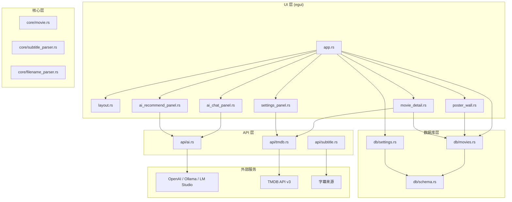

# AI-Movie-Player

一个面向电影爱好者的 AI 原生播放器，不只是打开文件，更帮助你理解和经营自己的片库。

[English](README.md) | 简体中文

[](https://www.rust-lang.org)
[](LICENSE)
[](https://github.com/peixl/AI-Movie-Player/releases)
[](https://github.com/peixl/AI-Movie-Player/actions/workflows/ci.yml)
[](https://github.com/peixl/AI-Movie-Player#ai-features)

项目由 [ifq.ai](https://ifq.ai) 打造，开源仓库位于 [peixl/AI-Movie-Player](https://github.com/peixl/AI-Movie-Player)。

## 项目简介

AI-Movie-Player 是一个基于 Rust 与 egui 构建的桌面电影播放器与片库助手。它把本地片库管理、TMDB 元数据、字幕工作流、海报墙浏览和 OpenAI-compatible AI 能力整合在一个更安静、更自然的电影体验里。

这个项目想做的不是"给播放器加一个 AI 按钮"，而是把"选片、看片、看后理解、片库管理"这整个链路做得更完整、更优雅。

## 技术栈

| 层级 | 技术 |
| --- | --- |
| 语言 | Rust (edition 2024, MSRV 1.85) |
| GUI 框架 | [egui](https://github.com/emilk/egui) / eframe 0.31 |
| 异步运行时 | [Tokio](https://tokio.rs) |
| 数据库 | [SQLite](https://sqlite.org) via rusqlite (WAL 模式, FTS5) |
| HTTP 客户端 | [reqwest](https://github.com/seanmonstar/reqwest) (gzip, brotli, stream) |
| 图像处理 | [image](https://github.com/image-rs/image) crate |
| 错误处理 | [thiserror](https://github.com/dtolnay/thiserror) + [anyhow](https://github.com/dtolnay/anyhow) |
| CI/CD | GitHub Actions (多平台矩阵) |

## 架构



## 为什么是 AI-Movie-Player

- 针对单部电影的 AI 对话，并且支持真正的多轮上下文记忆。
- 基于你自己的片库生成更有依据的推荐，而不是空泛的猜你喜欢。
- 从详情页一键进入 AI 解析、短评和观影建议。
- 使用 TMDB 自动补全标题、海报、导演、演员、评分和简介。
- 提供多来源字幕搜索与下载能力，服务本地观影场景。
- 支持海报墙浏览、批量导入、片单和设置等完整桌面工作流。
- ifq.ai 的标识保持克制，像作品署名，而不是宣传位。

## AI 功能

### AI Companion

选择一部电影后，AI 会结合片名、年份、导演、类型、剧情简介和演员阵容与你对话。现在聊天会保留上下文，所以追问和深入分析会自然很多，不再像一次性问答。

适合的问题包括：

- 深度解析
- 结局解读
- 相似电影推荐
- 幕后趣闻
- 观影陪伴提示
- 值不值得看

### AI Taste Engine

AI 会从你的片库中分析口味结构，告诉你现在最该看什么、为什么适合你、你的观影盲区在哪里，以及哪些你还没收藏的电影值得补进来。

### AI Review

在电影详情页可以直接进入 AI 解析，快速获取短评、优点、不足、适合人群和观影建议。

### 支持的 AI 提供方

AI-Movie-Player 兼容：

- OpenAI
- Azure OpenAI
- Ollama
- LM Studio
- 任意 OpenAI-compatible 接口

### 观影工作流

AI-Movie-Player 现在开始把 AI 能力做成更自然的观影流程，而不是零散问答：

- 观影前 briefing：在播放前给出情绪、背景和值得留意的细节。
- 观影后复盘：在片尾之后帮助用户整理主题、结构和关键选择。
- 双片连看建议：推荐一部真正能放大第一部电影价值的搭配影片，而不是偷懒的同类型相似片。

## 核心模块

| 模块 | 说明 |
| --- | --- |
| 片库 | 扫描文件夹、识别影片文件、避免重复导入，管理个人收藏。 |
| 元数据 | 通过 TMDB 补全标题、海报、演员、评分与简介。 |
| AI | 提供电影对话、AI 解析、观影画像和推荐流程。 |
| 字幕 | 从多个来源搜索并下载适合本地媒体的字幕。 |
| 海报墙 | 用更直观的视觉方式浏览收藏。 |
| 片单 | 管理接下来准备看的影片。 |

## 与普通播放器相比

| 能力 | 普通播放器 | AI-Movie-Player |
| --- | --- | --- |
| 打开本地文件 | 支持 | 支持 |
| TMDB 元数据补全 | 有时支持 | 内建 |
| 围绕单部电影的 AI 对话 | 少见 | 原生工作流 |
| 基于片库的推荐 | 少见 | 内建 |
| 观影工作流 | 基本没有 | 观影前、观影后、双片连看 |
| 字幕工作流 | 基础能力 | 更偏向搜索与下载闭环 |
| 产品气质 | 工具导向 | 电影导向，安静高级 |

## 快速开始

### 预编译版本

从 [Releases](https://github.com/peixl/AI-Movie-Player/releases) 页面下载适合您平台的最新版本：

- **Windows**: `.zip` 压缩包
- **macOS**: 包含 `.app` bundle 的 `.tar.gz`
- **Linux**: `.tar.gz` 压缩包

### 环境要求（从源码构建）

- Rust 1.85+
- 一个来自 [themoviedb.org/settings/api](https://www.themoviedb.org/settings/api) 的 TMDB API Key
- 可选：任意 OpenAI-compatible API Key

### 克隆并运行

```bash
git clone https://github.com/peixl/AI-Movie-Player.git
cd AI-Movie-Player
cargo run --release
```

## AI 配置

1. 打开 Settings。
2. 填写 AI Endpoint、API Key 和 Model。
3. 保存设置。
4. 如果使用本地模型，可以直接选择 Ollama 或 LM Studio 预设。

常见接口示例：

```text
OpenAI    -> https://api.openai.com/v1
Ollama    -> http://localhost:11434/v1
LM Studio -> http://localhost:1234/v1
```

## 快捷键

| 快捷键 | 功能 |
| --- | --- |
| Ctrl+1 | 片库 |
| Ctrl+2 | 导入影片 |
| Ctrl+3 | 字幕搜索 |
| Ctrl+4 | 批量操作 |
| Ctrl+5 | 片单 |
| Ctrl+6 | 设置 |
| Ctrl+7 | AI 对话 |
| Ctrl+8 | AI 推荐 |
| Ctrl+F | 搜索片库 |
| Esc | 返回 |

## 项目结构

```text
ai-movie-player/
├── src/
│   ├── main.rs                  # 入口，Tokio 运行时初始化
│   ├── app.rs                   # 应用核心结构体 (eframe::App)
│   ├── ai/                      # AI 提示词构建与工作流逻辑
│   ├── api/
│   │   ├── ai.rs                # OpenAI 兼容流式客户端
│   │   └── tmdb.rs              # TMDB API v3 客户端
│   ├── core/
│   │   ├── filename_parser.rs   # 从文件名提取元数据
│   │   ├── file_organizer.rs    # 文件整理与重命名
│   │   ├── library_manager.rs   # 片库扫描与导入
│   │   ├── metadata_service.rs  # TMDB 元数据补全
│   │   └── subtitle_finder.rs   # 字幕搜索协调
│   ├── db/
│   │   ├── schema.rs            # SQLite schema 与迁移
│   │   ├── movies.rs            # Movie CRUD 操作
│   │   └── settings.rs          # 设置键值存储
│   ├── ui/
│   │   ├── layout.rs            # 侧边栏导航与视图路由
│   │   ├── theme.rs             # 颜色系统与主题辅助
│   │   ├── icons.rs             # 程序化手绘图标系统
│   │   ├── animation.rs         # hover、shimmer、toast 动效
│   │   ├── poster_wall.rs       # 海报墙视觉浏览
│   │   ├── movie_detail.rs      # 电影详情面板（含海报缓存）
│   │   ├── ai_chat_panel.rs     # AI 伴侣流式对话
│   │   ├── ai_recommend_panel.rs# AI 口味引擎推荐
│   │   ├── settings_panel.rs    # 设置与 AI 配置
│   │   ├── add_movie.rs         # 影片导入工作流
│   │   ├── subtitle_panel.rs    # 字幕搜索与下载
│   │   ├── batch_ops.rs         # 批量操作
│   │   └── watchlist_panel.rs   # 片单管理
│   ├── config/
│   │   └── settings.rs          # AppSettings 模型
│   ├── thumbnail/
│   │   └── generator.rs         # 视频缩略图提取
│   └── util/
│       ├── error.rs             # AppError 类型
│       └── fs.rs                # 文件系统工具
├── .github/
│   ├── workflows/
│   │   ├── ci.yml               # CI: fmt, clippy, test, doc, build
│   │   ├── release.yml          # Release: 多平台打包 + 校验和
│   │   ├── labeler.yml          # 按文件路径自动标记 PR
│   │   └── stale.yml            # 自动关闭过期 issue
│   ├── ISSUE_TEMPLATE/          # Bug 报告、功能请求模板
│   ├── PULL_REQUEST_TEMPLATE.md # PR 检查清单
│   └── CODEOWNERS               # 代码所有权定义
├── docs/                        # 发布工具包、发布说明
├── Cargo.toml                   # 依赖与元数据
├── rustfmt.toml                 # 格式化配置
├── clippy.toml                  # Clippy 检查配置
├── README.md                    # 英文文档
├── readme-cn.md                 # 中文文档
├── CONTRIBUTING.md              # 英文贡献指南
├── contributing-cn.md           # 中文贡献指南
├── CHANGELOG.md                 # 英文更新日志
├── changelog-cn.md              # 中文更新日志
├── SECURITY.md                  # 安全政策
└── LICENSE                      # MIT 许可证
```

## 开发

```bash
cargo test
cargo fmt -- --check
cargo clippy -- -D warnings
cargo build --release
```

如果当前环境无法访问 crates.io，建议优先使用本地诊断或离线缓存做验证。

## 文档

- 英文文档： [README.md](README.md)
- 中文文档： [readme-cn.md](readme-cn.md)
- 英文贡献指南： [CONTRIBUTING.md](CONTRIBUTING.md)
- 中文贡献指南： [contributing-cn.md](contributing-cn.md)
- 英文更新日志： [CHANGELOG.md](CHANGELOG.md)
- 中文更新日志： [changelog-cn.md](changelog-cn.md)
- 安全政策： [SECURITY.md](SECURITY.md)
- GitHub 英文发布说明： [docs/github-launch-kit.md](docs/github-launch-kit.md)
- GitHub 中文发布说明： [docs/github-launch-kit-cn.md](docs/github-launch-kit-cn.md)

## 路线图

- 继续把 AI 观影工作流做得更像观影的一部分，而不是看完后才补一句聊天。
- 提升字幕质量排序和来源可靠性。
- 进一步优化大体量片库下的海报墙性能与观感。
- 完善跨平台打包与发布流程。
- 加强本地 AI 提供方与自托管接口的上手体验。

## FAQ

### 这是流媒体应用吗？

不是。AI-Movie-Player 主要围绕本地片库和个人媒体工作流构建。

### 不填 AI API Key 也能用吗？

可以。片库、海报、元数据和字幕等流程仍然可以使用；AI 功能才需要 OpenAI-compatible 提供方。

### 选哪个 AI 提供方比较好？

取决于你的使用方式。OpenAI 适合最快开始，Ollama 和 LM Studio 更适合本地模型方案。

### 为什么 ifq.ai 的标识这么克制？

因为这个项目把 ifq.ai 视为作品署名，而不是打断体验的宣传位。产品应该先显得优雅，再让品牌被自然认出来。

## 参与贡献

开发流程、代码标准和 PR 要求见 [CONTRIBUTING.md](CONTRIBUTING.md)。

## 许可证

MIT，详见 [LICENSE](LICENSE)。

## 致谢

- [TMDB](https://www.themoviedb.org/) 提供电影元数据和海报 API。
- [egui](https://github.com/emilk/egui) 提供即时模式 GUI 框架。
- [OpenAI](https://openai.com) 定义了被生态系统广泛采用的 Chat Completions API 标准。
- [Ollama](https://ollama.com) 和 [LM Studio](https://lmstudio.ai) 社区推动本地 AI 工具发展。

由 [ifq.ai](https://ifq.ai) 用心打造。
